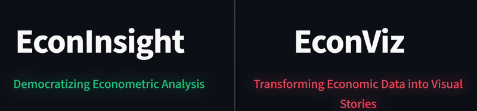
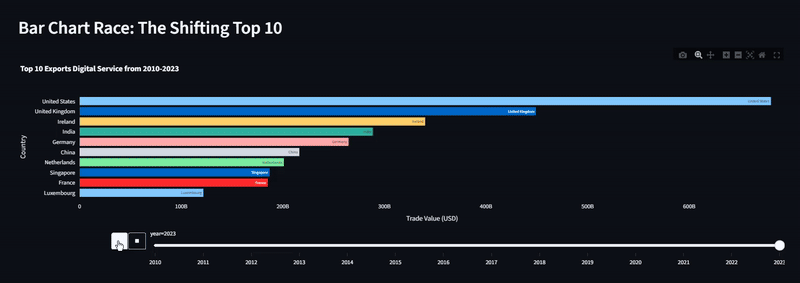
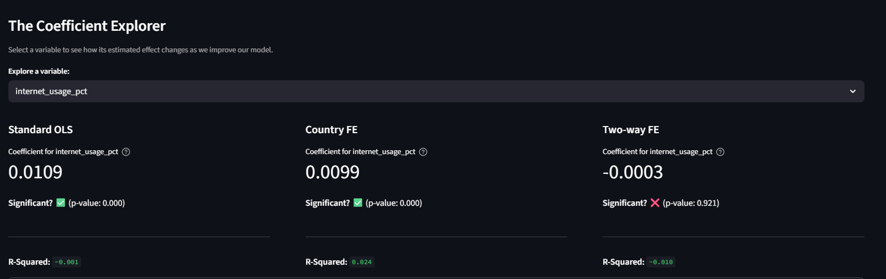
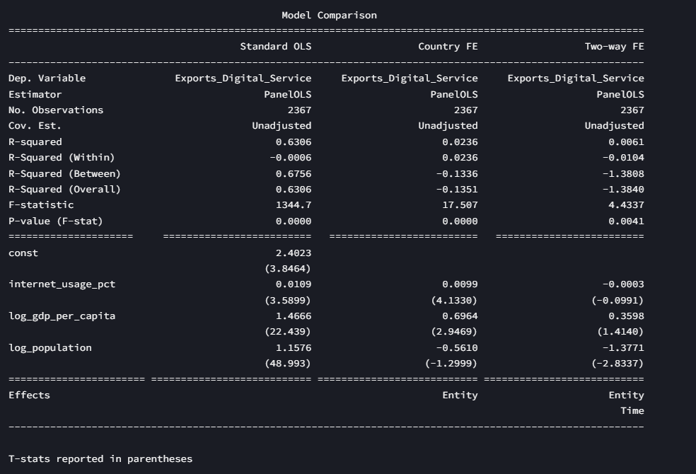
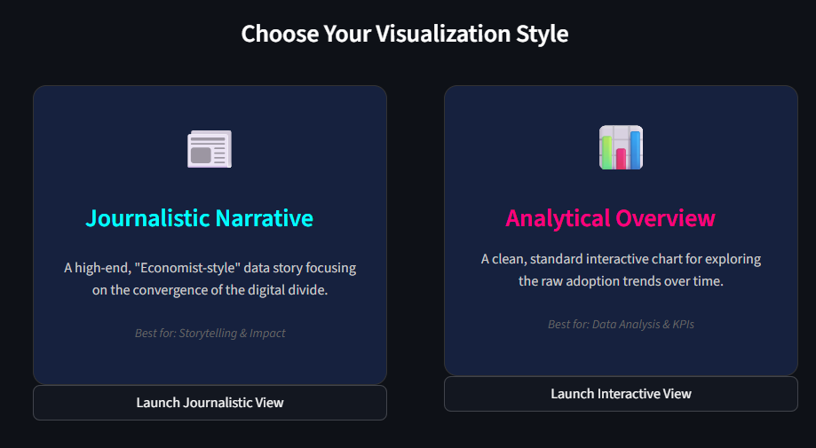
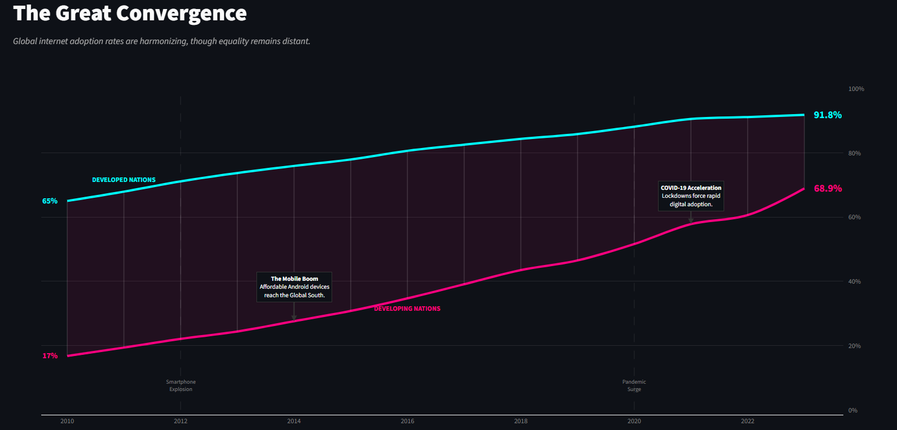
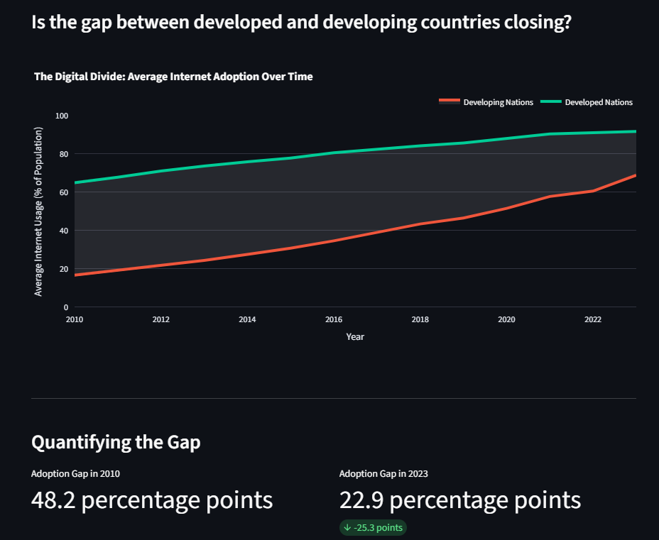
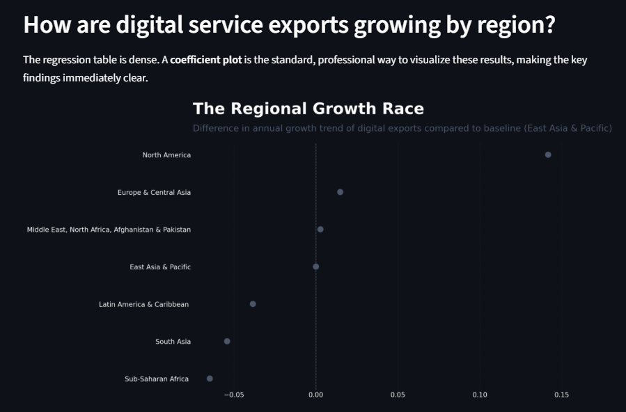
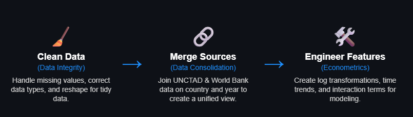

# 💡EconInsight & 🔮EconViz

## An Analysis of Global Digital Trade and Technology Adoption

*Exploring the key drivers and leaders of the digital service economy from 2010 to 2023.*

This repository contains the data, analysis notebooks, and Streamlit web application for the "Programming with Data" final project. The project investigates the landscape of global digital trade and examines the econometric relationship between technology adoption and digital service exports.


---

## 📋 Table of Contents

1.  [Key Research Questions](#-key-research-questions)
2.  [Data Overview](#-data-overview)
3.  [Technical Implementation](#️-technical-implementation)
4.  [Project Structure](#-project-structure)
5.  [Usage](#-usage)

---

## ✨ Featured Visualization: Interactive 3D Data Cloud

To showcase the relationship between Internet Usage, GDP, and Digital Service Exports, we created a fully interactive 3D scatter plot using Plotly. The GIF below demonstrates the interactivity.


  

---

## 🚀 Key Research Questions

This project answers four primary questions:

**1. 🌍 Global Digital Trade Landscape**
> *Which countries lead in digital service exports and how has this evolved?*
>
> **Takeaway:** A small group of developed nations, including Ireland, the United States, and Germany, consistently dominate the top ranks. However, the animated bar chart race reveals a dynamic mid-tier, with countries like China and India demonstrating significant upward momentum over the last decade.



**2. ⚙️ Technology Adoption & Trade**
> *Is there a relationship between internet adoption and digital service exports?*
>
> **Takeaway:** Yes, but the story is complex. While a strong positive visual correlation exists, our rigorous econometric analysis shows this simple relationship is misleading. After controlling for country-specific characteristics and global time-based shocks using a Two-Way Fixed Effects model, the direct impact of internet usage becomes statistically insignificant, highlighting the importance of advanced modeling to avoid false conclusions.




**3. 📡 The Digital Divide**
> *Is the gap between developed and developing countries closing? How are adoption rates changing over time?*
>
> **Takeaway:** The gap is closing rapidly. The difference in average internet adoption between developed and developing nations has shrunk significantly, driven by high-percentage grwoth in the Global South.



**Journalistic Narrative**



**Analytical Overview**



**4. 💡 Regional Growth Impact**
> *Which regions are leading digital transformation? How are digital service exports growing by region?*
>
> **Takeaway:** The DiD analysis shows the established leaders are accelerating their lead. North America and Europe have a statistically significant, faster annual growth trend in digital exports compared to the baseline.




---

## 📊 Data Overview

The analysis is based on a comprehensive panel dataset compiled from primary public sources.

| Variable | Description | Source |
| :--- | :--- | :--- |
| `Exports_Digital_Service` | Volume of digital service exports | World Bank / UNCTAD |
| `internet_usage_pct` | Percentage of population using the internet | World Bank |
| `gdp_per_capita` | Gross Domestic Product per capita | World Bank |
| `population` | Total population | World Bank |
| `is_developing` | Development status classification | World Bank |

The final dataset covers approximately 150 countries over a span from 2010 to 2023. I utilized the [`wbdata`](https://wbdata.readthedocs.io/en/stable/) Python library to systematically account for missing values in the main dataset.

**Primary Data Source:** [World Bank Data (UNCTAD_DE)](https://data.worldbank.org/ )

**The Raw Datasets**


**The Methodology of my project**


---

## 🛠️ Technical Implementation

The project was executed through a series of robust data processing and analysis steps:

**1. Data Cleaning & Harmonization**
- Raw CSV files from the OECD and World Bank were ingested using **Pandas**.
- Datasets were cleaned, harmonized, and merged into a single, tidy panel DataFrame (`final_panel_for_regression.csv`).

**2. Analysis & Modeling**
- **Baseline OLS:** Initial regression analysis performed using **Statsmodels**.
- **Panel Data Models:** Implementation of Fixed Effects and Two-Way Fixed Effects models using the **linearmodels** library to control for unobserved heterogeneity.

**3. Visualization & Dashboarding**
- **Interactive Web App:** Built with **Streamlit** to allow users to explore the data dynamically.
- **Advanced Charts:** Choropleth maps, animated bar charts, and 3D scatter plots created with **Plotly Express** and **Plotly Graph Objects**.
- **Custom Styling:** A polished dark theme and custom CSS (via `config.toml`) ensure a high-quality user experience.

---

## 📦 Project Structure

```
KLDR-Project/

│
├── 📁 app/                   # Core Streamlit application source code
│   ├── 📁 .streamlit/        # Streamlit configuration files (e.g., config.toml for themes)
│   ├── 📁 data/               # Data files used directly by the live application
│   │   ├── 📁 output/         # Processed data from notebooks, ready for visualization
│   │   │   ├── 📁 question1/
│   │   │   ├── 📁 question2_paneldata/
│   │   │   ├── 📁 question3/
│   │   │   └── 📁 question4/
│   │   └── 📁 tables/         # Other miscellaneous data tables
│   ├── 📁 pages/              # Each .py file here is a separate page/tab in the Streamlit app
│   │   ├── 📄 data_assistant.py
│   │   ├── 📄 data_overview.py
│   │   ├── 📄 EconInsight.py
│   │   ├── 📄 EconViz.py
│   │   ├── 📄 homepage1.py
│   │   ├── 📄 homepage2.py
│   │   └── 📄 must-know.py
│   ├── 📁 utils/              # Utility scripts and helper functions
│   │   └── 📄 common_imports.py
│   └── 📄 app.py                # Main entry point to run the Streamlit application
│
├── 📁 drafts/                  # Folder for draft scripts or old code versions
├── 📁 scripts/                 # Standalone helper scripts for tasks
│
├── 📄 .gitignore               # Specifies files and folders for Git to ignore
├── 📄 README.md                # This project documentation file
├── 📄 requirements.txt         # List of Python libraries required for the project

```


---

## 💻 Usage

To run the dashboard locally:

1.  **Clone the repository:**
    ```bash
    git clone https://github.com/kevindrmo/kldr-project.git
    cd kldr-project
    ```

2.  **Install dependencies:**
    ```bash
    pip install -r requirements.txt
    ```

3.  **Run the Streamlit app:**
    ```bash
    streamlit run app/app.py
    ```

---

<sub>Built by Kevin Di Raimo for the Data Analysis with Python Course of University of Zurich</sub>
</p>
